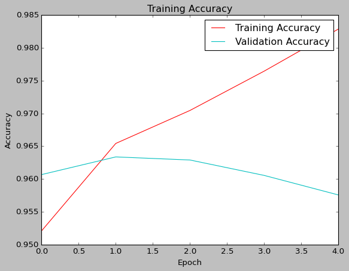
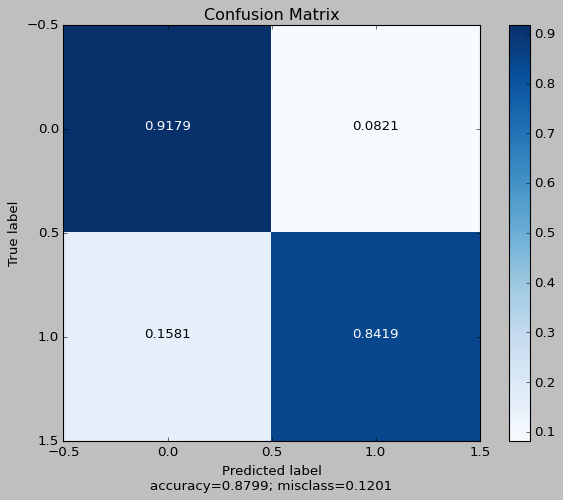
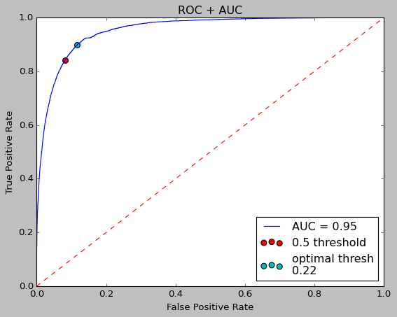

# Toxicity-In-Gaming-Communities
To evaluate the levels of toxicity in select gaming communities, we learned a model using the Jigsaw Toxic Comment Classification Challenge on Kaggle.com. We simplified the task from a multi-class classification problem into a binary classification problem by determining whether or not a comment is toxic. The model is then applied to a dataset of Reddit comments gathered over one week using the Pushshift API. We compared the data on the World of Warcraft (/r/wow), League of Legends (/r/leagueoflegends), and Final Fantasy XIV (/r/ffxiv) subreddits. These three were chosen as they were the most prominent games I personally played at the time.

This model predicts the following toxicity in subreddits:
1. Final Fantasy XIV (/r/ffxiv) : 6.18%
2. World of Warcraft (/r/wow) : 8.10%
3. League of Legends (/r/leagueoflegends) : 9.82%

Further improvements to this model could be applying transfer learning by creating a specific train/test dataset using the scraped Reddit data, and then training the already pre-trained jigsaw model over the new dataset. We can also see alternative extrapolation by applying this model to different subreddits.

## Toxic Comments Model
The model used is a recurrent neural network (RNN) built using bidirectional LSTM layers over a word embedding. The outputs are a single binary classification neuron. The model summary and hyperparameters used for training is detailed in the notebook. The model is optimized over its ROC/AUC to determine the optimal determining threshold at 0.22.

The optimized confusion matrix given the 0.22 threshold is as follows:

